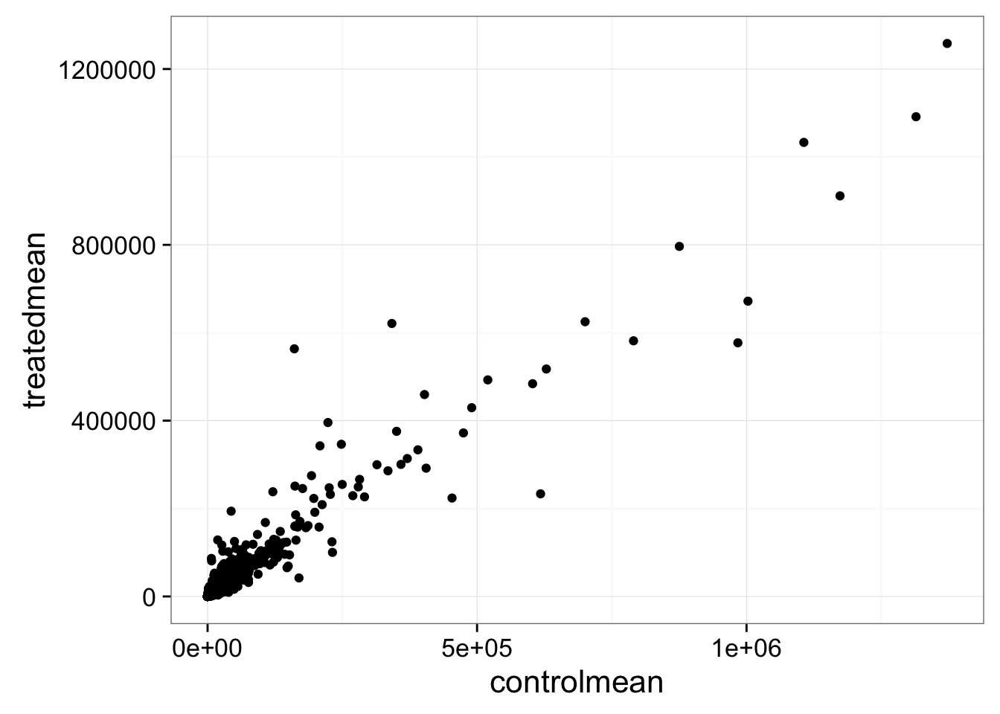
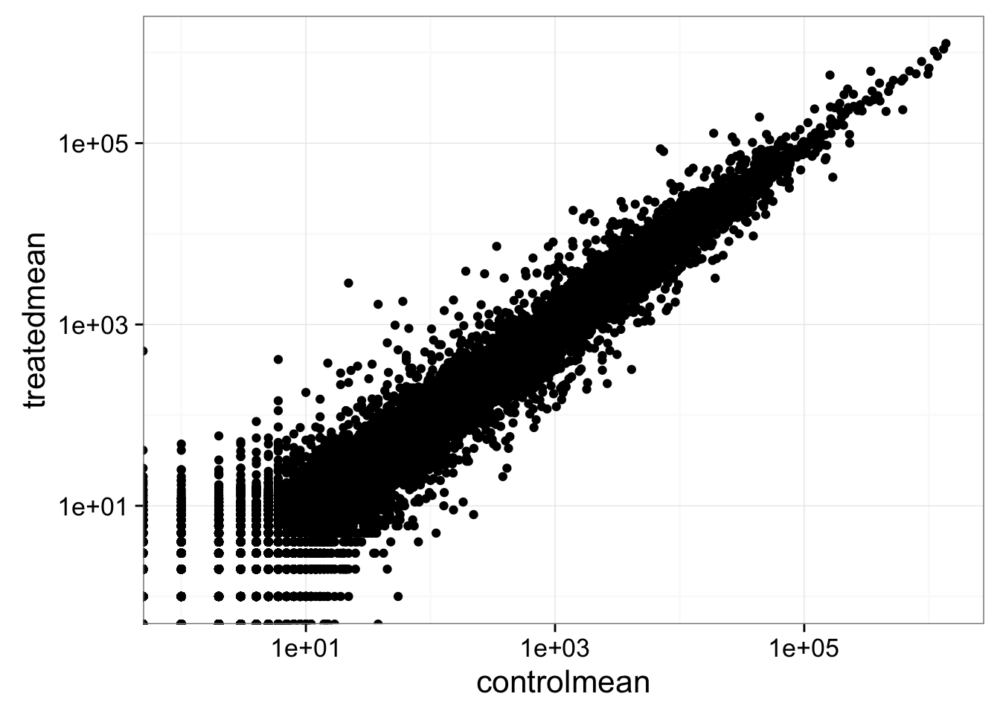
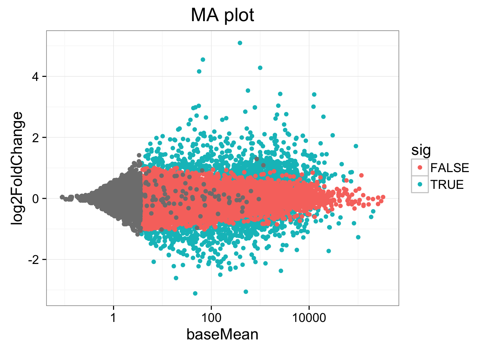
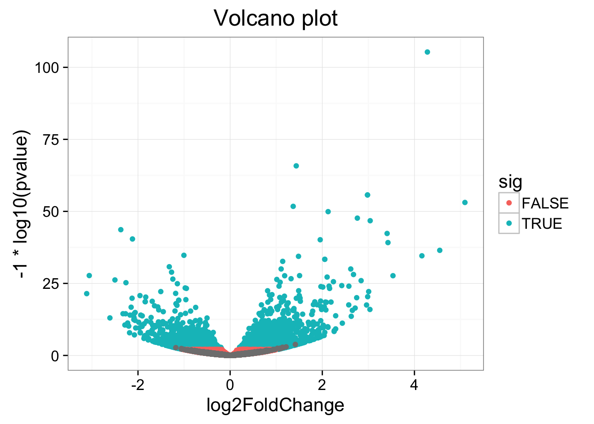

# Exercise 1

If we look at our metadata, we see that the control samples are SRR1039508, SRR1039512, SRR1039516, and SRR1039520. This bit of code will take the mycounts data, `mutate()` it to add a column called `controlmean`, then `select()` only the gene name and this newly created column, and assigning the result to a new object called `mycounts`. (_Hint_: `mycounts %>% mutate(...) %>% select(...)`)


```r
meancounts <- mycounts %>% 
  mutate(controlmean = (SRR1039508+SRR1039512+SRR1039516+SRR1039520)/4) %>% 
  select(ensgene, controlmean)
meancounts
```

```
## # A tibble: 38,694 X 2
##            ensgene controlmean
##              <chr>       <dbl>
## 1  ENSG00000000003      900.75
## 2  ENSG00000000005        0.00
## 3  ENSG00000000419      520.50
## 4  ENSG00000000457      339.75
## 5  ENSG00000000460       97.25
## 6  ENSG00000000938        0.75
## 7  ENSG00000000971     5219.00
## 8  ENSG00000001036     2327.00
## 9  ENSG00000001084      755.75
## 10 ENSG00000001167      527.75
## # ... with 38,684 more rows
```

1. Build off of this code, `mutate()` it once more (prior to the `select()`) function, to add another column called `treatedmean` that takes the mean of the expression values of the treated samples. Then `select()` only the `ensgene`, `controlmean` and `treatedmean` columns, assigning it to a new object called meancounts.


```
## # A tibble: 38,694 X 3
##            ensgene controlmean treatedmean
##              <chr>       <dbl>       <dbl>
## 1  ENSG00000000003      900.75      658.00
## 2  ENSG00000000005        0.00        0.00
## 3  ENSG00000000419      520.50      546.00
## 4  ENSG00000000457      339.75      316.50
## 5  ENSG00000000460       97.25       78.75
## 6  ENSG00000000938        0.75        0.00
## 7  ENSG00000000971     5219.00     6687.50
## 8  ENSG00000001036     2327.00     1785.75
## 9  ENSG00000001084      755.75      578.00
## 10 ENSG00000001167      527.75      348.25
## # ... with 38,684 more rows
```

2. Directly comparing the raw counts is going to be problematic if we just happened to sequence one group at a higher depth than another. Later on we'll do this analysis properly, normalizing by sequencing depth per sample using a better approach. But for now, `summarize()` the data to show the `sum` of the mean counts across all genes for each group. Your answer should look like this:


```
## # A tibble: 1 X 2
##   `sum(controlmean)` `sum(treatedmean)`
##                <dbl>              <dbl>
## 1           23005324           22196524
```

# Exercise 2

1. Create a scatter plot showing the mean of the treated samples against the mean of the control samples.

{width=5in}

2. Wait a sec. There are 60,000-some rows in this data, but I'm only seeing a few dozen dots at most outside of the big clump around the origin. Try plotting both axes on a log scale (_hint_: `... + scale_..._log10()`)

{width=5in}

\newpage

# Exercise 3

Look up help on `?inner_join` or Google around for help for using **dplyr**'s `inner_join()` to join two tables by a common column/key. You downloaded [annotables_grch38.csv](data/annotables_grch38.csv) from [the data downloads page](data.html) on bioconnector.org. Load this data with `read_csv()` into an object called `anno`. Pipe it to `View()` or click on the object in the Environment pane to view the entire dataset. This table links the unambiguous Ensembl gene ID to things like the gene symbol, full gene name, location, Entrez gene ID, etc.


```r
anno <- read_csv("data/annotables_grch38.csv")
anno
```

```
## # A tibble: 66,531 X 9
##            ensgene entrez   symbol   chr     start       end strand
##              <chr>  <int>    <chr> <chr>     <int>     <int>  <int>
## 1  ENSG00000000003   7105   TSPAN6     X 100627109 100639991     -1
## 2  ENSG00000000005  64102     TNMD     X 100584802 100599885      1
## 3  ENSG00000000419   8813     DPM1    20  50934867  50958555     -1
## 4  ENSG00000000457  57147    SCYL3     1 169849631 169894267     -1
## 5  ENSG00000000460  55732 C1orf112     1 169662007 169854080      1
## 6  ENSG00000000938   2268      FGR     1  27612064  27635277     -1
## 7  ENSG00000000971   3075      CFH     1 196651878 196747504      1
## 8  ENSG00000001036   2519    FUCA2     6 143494811 143511690     -1
## 9  ENSG00000001084   2729     GCLC     6  53497341  53616970     -1
## 10 ENSG00000001167   4800     NFYA     6  41072945  41099976      1
## # ... with 66,521 more rows, and 2 more variables: biotype <chr>,
## #   description <chr>
```

1. Take our newly created `meancounts` object, and `arrange()` it `desc`ending by the absolute value (`abs()`) of the `log2fc` column. The first few rows should look like this:


```
## # A tibble: 3 X 4
##           ensgene controlmean treatedmean   log2fc
##             <chr>       <dbl>       <dbl>    <dbl>
## 1 ENSG00000179593        0.25      129.50 9.016808
## 2 ENSG00000277196        0.50       63.75 6.994353
## 3 ENSG00000109906       14.75      808.75 5.776907
```

2. Continue on that pipeline, and `inner_join()` it to the `anno` data by the `ensgene` column. Either assign it to a temporary object or pipe the whole thing to `View` to take a look. What do you notice? Would you trust these results? Why or why not?


```
## # A tibble: 21,995 X 12
##            ensgene controlmean treatedmean    log2fc    entrez     symbol
##              <chr>       <dbl>       <dbl>     <dbl>     <int>      <chr>
## 1  ENSG00000179593        0.25      129.50  9.016808       247    ALOX15B
## 2  ENSG00000277196        0.50       63.75  6.994353 102724788 AC007325.2
## 3  ENSG00000109906       14.75      808.75  5.776907      7704     ZBTB16
## 4  ENSG00000128285       12.75        0.25 -5.672425      2847      MCHR1
## 5  ENSG00000171819        9.00      427.25  5.569012     10218    ANGPTL7
## 6  ENSG00000137673        0.25       10.25  5.357552      4316       MMP7
## 7  ENSG00000241713        0.25        7.25  4.857981     58496     LY6G5B
## 8  ENSG00000277399        0.50       13.25  4.727920    440435     GPR179
## 9  ENSG00000118729       25.50        1.00 -4.672425       845      CASQ2
## 10 ENSG00000127954       34.25      826.75  4.593275     79689     STEAP4
## # ... with 21,985 more rows, and 6 more variables: chr <chr>, start <int>,
## #   end <int>, strand <int>, biotype <chr>, description <chr>
```

\newpage

# Exercise 4

1. Using a `%>%`, `arrange` the results by the adjusted p-value.


```
## # A tibble: 38,694 X 7
##                row   baseMean log2FoldChange      lfcSE      stat
##              <chr>      <dbl>          <dbl>      <dbl>     <dbl>
## 1  ENSG00000152583   954.7709       3.967218 0.21418203  18.52265
## 2  ENSG00000179094   743.2527       2.713796 0.16604531  16.34371
## 3  ENSG00000116584  2277.9135      -1.026906 0.06455769 -15.90680
## 4  ENSG00000189221  2383.7537       3.090899 0.19634159  15.74246
## 5  ENSG00000120129  3440.7038       2.759464 0.18951296  14.56082
## 6  ENSG00000148175 13493.9204       1.401834 0.09858337  14.21978
## 7  ENSG00000109906   439.5415       4.417136 0.31408462  14.06352
## 8  ENSG00000178695  2685.4097      -2.355112 0.16841404 -13.98406
## 9  ENSG00000134686  2933.6425       1.411139 0.10373478  13.60334
## 10 ENSG00000101347 14134.9918       3.356839 0.24864303  13.50063
## # ... with 38,684 more rows, and 2 more variables: pvalue <dbl>,
## #   padj <dbl>
```

2. Continue piping to `inner_join()`, joining the results to the `anno` object. See the help for `?inner_join`, specifically the `by=` argument. You'll have to do something like `... %>% inner_join(anno, by=c("row"="ensgene"))`. Once you're happy with this result, reassign the result back to `res`. It'll look like this.


```
##               row   baseMean log2FoldChange      lfcSE      stat
## 1 ENSG00000152583   954.7709       3.967218 0.21418203  18.52265
## 2 ENSG00000179094   743.2527       2.713796 0.16604531  16.34371
## 3 ENSG00000116584  2277.9135      -1.026906 0.06455769 -15.90680
## 4 ENSG00000189221  2383.7537       3.090899 0.19634159  15.74246
## 5 ENSG00000120129  3440.7038       2.759464 0.18951296  14.56082
## 6 ENSG00000148175 13493.9204       1.401834 0.09858337  14.21978
##         pvalue         padj entrez  symbol chr     start       end strand
## 1 1.356017e-76 2.051382e-72   8404 SPARCL1   4  87473335  87531061     -1
## 2 4.822927e-60 3.648062e-56   5187    PER1  17   8140472   8156506     -1
## 3 5.684877e-57 2.866694e-53   9181 ARHGEF2   1 155946851 156007070     -1
## 4 7.738138e-56 2.926564e-52   4128    MAOA   X  43654907  43746824      1
## 5 4.985827e-48 1.508512e-44   1843   DUSP1   5 172768090 172771195     -1
## 6 6.906757e-46 1.741424e-42   2040    STOM   9 121338988 121370304     -1
##          biotype
## 1 protein_coding
## 2 protein_coding
## 3 protein_coding
## 4 protein_coding
## 5 protein_coding
## 6 protein_coding
##                                                                            description
## 1                             SPARC-like 1 (hevin) [Source:HGNC Symbol;Acc:HGNC:11220]
## 2                          period circadian clock 1 [Source:HGNC Symbol;Acc:HGNC:8845]
## 3 Rho/Rac guanine nucleotide exchange factor (GEF) 2 [Source:HGNC Symbol;Acc:HGNC:682]
## 4                               monoamine oxidase A [Source:HGNC Symbol;Acc:HGNC:6833]
## 5                    dual specificity phosphatase 1 [Source:HGNC Symbol;Acc:HGNC:3064]
## 6                                          stomatin [Source:HGNC Symbol;Acc:HGNC:3383]
```

3. How many are significant with an adjusted p-value <0.05? (Pipe to `filter()`).


```
## [1] 2184
```

\newpage

# Exercise 5

Look up the Wikipedia articles on [MA plots](https://en.wikipedia.org/wiki/MA_plot) and [volcano plots](https://en.wikipedia.org/wiki/Volcano_plot_(statistics)). An MA plot shows the average expression on the X-axis and the log fold change on the y-axis. A volcano plot shows the log fold change on the X-axis, and the $-log_{10}$ of the p-value on the Y-axis (the more significant the p-value, the larger the $-log_{10}$ of that value will be).

1. Make an MA plot. Use a $log_{10}$-scaled x-axis, color-code by whether the gene is significant, and give your plot a title. It should look like this. What's the deal with the gray points?
2. Make a volcano plot. Similarly, color-code by whether it's significant or not.

{width=5in}


{width=5in}


