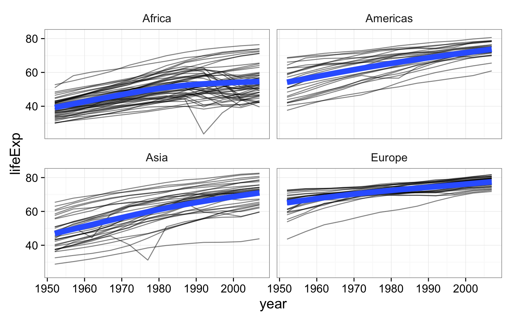

## Exercise set 1

Re-create this same plot from scratch without saving anything to a variable. That is, start from the `ggplot` call. 

* Start with the `ggplot()` function using the gm data.
* Create an aesthetic mapping of `gdpPercap` to the x-axis and `lifeExp` to the y-axis.
* Add points to the plot: Make the points size 3 and map continent onto the aesthetics of the point
* Use a log10 scale for the x-axis.

## Exercise set 2

1. Make a scatter plot of `lifeExp` on the y-axis against `year` on the x.
1. Make a series of small multiples faceting on continent.
1. Add a fitted curve, smooth or lm, with and without facets.
1. **Bonus**: using `geom_line()` and and aesthetic mapping `country` to `group=`, make a "spaghetti plot", showing _semitransparent_ lines connected for each country, faceted by continent. Add a smoothed loess curve with a thick (`lwd=3`) line with no standard error stripe. Reduce the opacity (`alpha=`) of the individual black lines. _Don't_ show Oceania countries (that is, `filter()` the data where `continent!="Oceania"` before you plot it).

{width=4in}

## Exercise set 3

1. Make a jittered strip plot of GDP per capita against continent.
1. Make a box plot of GDP per capita against continent.
1. Using a log10 y-axis scale, overlay semitransparent jittered points on top of box plots, where outlying points are colored. 
1. **BONUS**: Try to reorder the continents on the x-axis by GDP per capita. Why isn't this working as expected? See `?reorder` for clues.

## Exercise set 4

1. Plot a histogram of GDP Per Capita.
1. Do the same but use a log10 x-axis.
1. Still on the log10 x-axis scale, try a density plot mapping continent to the fill of each density distribution, and reduce the opacity.
1. Still on the log10 x-axis scale, make a histogram faceted by continent _and_ filled by continent. Facet with a single column (see `?facet_wrap` for help). 
1. Save this figure to a 6x10 PDF file.

