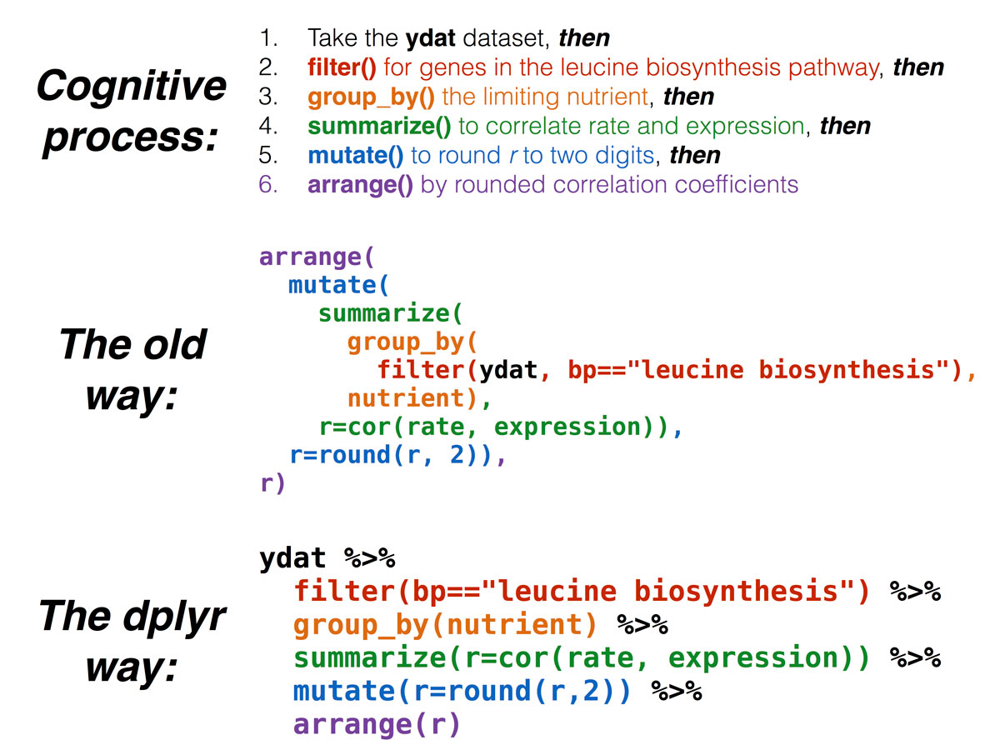

```{r init, include=F}
library(knitr)
opts_chunk$set(message=FALSE, warning=FALSE, eval=TRUE, echo=TRUE, cache=TRUE)
options(digits=3)
options(max.print=200)
.ex <- 1 # Track ex numbers w/ hidden var. Increment each ex: `r .ex``r .ex=.ex+1`

library(ggplot2)
theme_set(theme_bw(base_size=16) + theme(strip.background = element_blank()))
```

Data analysis involves a large amount of [janitor work](http://www.nytimes.com/2014/08/18/technology/for-big-data-scientists-hurdle-to-insights-is-janitor-work.html) -- munging and cleaning data to facilitate downstream data analysis. This lesson demonstrates techniques for advanced data manipulation and analysis with the split-apply-combine strategy. We will use the dplyr package in R to effectively manipulate and conditionally compute summary statistics over subsets of a "big" dataset containing many observations.

**This lesson assumes a [basic familiarity with R](r-basics.html) and [data frames](r-dataframes.html).**

**Recommended reading:** Review the [_Introduction_ (10.1)](http://r4ds.had.co.nz/tibbles.html#introduction-4) and [_Tibbles vs. data.frame_ (10.3)](http://r4ds.had.co.nz/tibbles.html#tibbles-vs.data.frame) sections of the [**_R for Data Science_ book**](http://r4ds.had.co.nz/tibbles.html). We will initially be using the `read_*` functions from the [**readr** package](http://readr.tidyverse.org/). These functions load data into a _tibble_ instead of R's traditional data.frame. Tibbles are data frames, but they tweak some older behaviors to make life a little easier. These sections explain the few key small differences between traditional data.frames and tibbles. 


## Review

### Our data

We're going to use the yeast gene expression dataset [described on the data frames lesson](r-dataframes.html#our-data). This is a cleaned up version of a gene expression dataset from [Brauer et al. Coordination of Growth Rate, Cell Cycle, Stress Response, and Metabolic Activity in Yeast (2008) _Mol Biol Cell_ 19:352-367](http://www.ncbi.nlm.nih.gov/pubmed/17959824). This data is from a gene expression microarray, and in this paper the authors are examining the relationship between growth rate and gene expression in yeast cultures limited by one of six different nutrients (glucose, leucine, ammonium, sulfate, phosphate, uracil). If you give yeast a rich media loaded with nutrients except restrict the supply of a _single_ nutrient, you can control the growth rate to any rate you choose. By starving yeast of specific nutrients you can find genes that: 

1. **Raise or lower their expression in response to growth rate**. Growth-rate dependent expression patterns can tell us a lot about cell cycle control, and how the cell responds to stress. The authors found that expression of >25% of all yeast genes is linearly correlated with growth rate, independent of the limiting nutrient. They also found that the subset of negatively growth-correlated genes is enriched for peroxisomal functions, and positively correlated genes mainly encode ribosomal functions. 
2. **Respond differently when different nutrients are being limited**. If you see particular genes that respond very differently when a nutrient is sharply restricted, these genes might be involved in the transport or metabolism of that specific nutrient.

You can download the cleaned up version of the data at [the link above](data.html). The file is called [**brauer2007_tidy.csv**](data/brauer2007_tidy.csv). Later on we'll actually start with the original raw data (minimally processed) and manipulate it so that we can make it more amenable for analysis. 

### Reading in data

We need to load both the dplyr and readr packages for efficiently reading in and displaying this data. We're also going to use many other functions from the dplyr package. Make sure you have these packages installed as described on the [setup page](setup.html).

```{r loadpkgs, results='hold'}
# Load packages
library(readr)
library(dplyr)

# Read in data
ydat <- read_csv(file="data/brauer2007_tidy.csv")

# Display the data
ydat

# Optionally, bring up the data in a viewer window
# View(ydat)
```

## The dplyr package

The [dplyr package](https://github.com/hadley/dplyr) is a relatively new R package that makes data manipulation fast and easy. It imports functionality from another package called magrittr that allows you to chain commands together into a pipeline that will completely change the way you write R code such that you're writing code the way you're thinking about the problem.

When you read in data with the readr package (`read_csv()`) and you had the dplyr package loaded already, the data frame takes on this "special" class of data frames called a `tbl` (pronounced "tibble"), which you can see with `class(ydat)`. If you have other "regular" data frames in your workspace, the `as_tibble()` function will convert it into the special dplyr `tbl` that displays nicely (e.g.: `iris <- as_tibble(iris)`). You don't have to turn all your data frame objects into tibbles, but it does make working with large datasets a bit easier. 

You can read more about tibbles in [Tibbles chapter in _R for Data Science_](http://r4ds.had.co.nz/tibbles.html) or in the [tibbles vignette](https://cran.r-project.org/web/packages/tibble/vignettes/tibble.html). They keep most of the features of data frames, and drop the features that used to be convenient but are now frustrating (i.e. converting character vectors to factors). You can read more about the differences between data frames and tibbles in [this section of the tibbles vignette](https://cran.r-project.org/web/packages/tibble/vignettes/tibble.html#tibbles-vs-data-frames), but the major convenience for us concerns **printing** (aka displaying) a tibble to the screen. When you print (i.e., display) a tibble, it only shows the first 10 rows and all the columns that fit on one screen. It also prints an abbreviated description of the column type. You can control the default appearance with options:

- `options(tibble.print_max = n, tibble.print_min = m)`: if there are more than _n_ rows, print only the first _m_ rows. Use `options(tibble.print_max = Inf)` to always show all rows.
- `options(tibble.width = Inf)` will always print all columns, regardless of the width of the screen.

## dplyr verbs

The dplyr package gives you a handful of useful **verbs** for managing data. On their own they don't do anything that base R can't do. Here are some of the _single-table_ verbs we'll be working with in this lesson (single-table meaning that they only work on a single table -- contrast that to _two-table_ verbs used for joining data together, which we'll cover in a later lesson).

1. `filter()`
1. `select()`
1. `mutate()`
1. `arrange()`
1. `summarize()`
1. `group_by()`

They all take a data frame or tibble as their input for the first argument, and they all return a data frame or tibble as output.

### filter()

If you want to filter **rows** of the data where some condition is true, use the `filter()` function. 

1. The first argument is the data frame you want to filter, e.g. `filter(mydata, ...`.
2. The second argument is a condition you must satisfy, e.g. `filter(ydat, symbol == "LEU1")`. If you want to satisfy *all* of multiple conditions, you can use the "and" operator, `&`. The "or" operator `|` (the pipe character, usually shift-backslash) will return a subset that meet *any* of the conditions.

- `==`: Equal to
- `!=`: Not equal to
- `>`, `>=`: Greater than, greater than or equal to
- `<`, `<=`: Less than, less than or equal to

Let's try it out. For this to work you have to have already loaded the dplyr package. Let's take a look at [LEU1](http://www.yeastgenome.org/locus/Leu1/overview), a gene involved in leucine synthesis.

```{r filter}
# First, make sure you've loaded the dplyr package
library(dplyr)

# Look at a single gene involved in leucine synthesis pathway
filter(ydat, symbol == "LEU1")

# Optionally, bring that result up in a View window
# View(filter(ydat, symbol == "LEU1"))

# Look at multiple genes
filter(ydat, symbol=="LEU1" | symbol=="ADH2")

# Look at LEU1 expression at a low growth rate due to nutrient depletion
# Notice how LEU1 is highly upregulated when leucine is depleted!
filter(ydat, symbol=="LEU1" & rate==.05)

# But expression goes back down when the growth/nutrient restriction is relaxed
filter(ydat, symbol=="LEU1" & rate==.3)

# Show only stats for LEU1 and Leucine depletion. 
# LEU1 expression starts off high and drops
filter(ydat, symbol=="LEU1" & nutrient=="Leucine")

# What about LEU1 expression with other nutrients being depleted?
filter(ydat, symbol=="LEU1" & nutrient=="Glucose")
```

Let's look at this graphically. Don't worry about what these commands are doing just yet - we'll cover that later on when we talk about ggplot2. Here's I'm taking the filtered dataset containing just expression estimates for LEU1 where I have 36 rows (one for each of 6 nutrients $\times$ 6 growth rates), and I'm _piping_ that dataset to the plotting function, where I'm plotting rate on the x-axis, expression on the y-axis, mapping the value of nutrient to the color, and using a line plot to display the data.

```{r demo_plot_expr_over_rate_singlegene, fig.align='center'}
library(ggplot2)
filter(ydat, symbol=="LEU1") %>% 
  ggplot(aes(rate, expression, colour=nutrient)) + geom_line(lwd=1.5)
```

Look closely at that! LEU1 is _highly expressed_ when starved of leucine because the cell has to synthesize its own! And as the amount of leucine in the environment (the growth _rate_) increases, the cell can worry less about synthesizing leucine, so LEU1 expression goes back down. Consequently the cell can devote more energy into other functions, and we see other genes' expression very slightly raising.

----

**EXERCISE `r .ex``r .ex=.ex+1`**

1. Display the data where the gene ontology biological process (the `bp` variable) is "leucine biosynthesis" (case-sensitive) _and_ the limiting nutrient was Leucine. (Answer should return a 24-by-7 data frame -- 4 genes $\times$ 6 growth rates).
1. Gene/rate combinations had high expression (in the top 1% of expressed genes)? _Hint:_ see `?quantile` and try `quantile(ydat$expression, probs=.99)` to see the expression value which is higher than 99% of all the data, then `filter()` based on that. Try wrapping your answer with a `View()` function so you can see the whole thing. What does it look like those genes are doing? Answer should return a 1971-by-7 data frame.

```{r ex_filter, include=F}
filter(ydat, nutrient=="Leucine" & bp=="leucine biosynthesis")

quantile(ydat$expression, probs=.99)
filter(ydat, expression>2.07)
```

----

#### Aside: Writing Data to File

What we've done up to this point is read in data from a file (`read_csv(...)`), and assigning that to an object in our _workspace_ (`ydat <- ...`). When we run operations like `filter()` on our data, consider two things:

1. The `ydat` object in our workspace is not being modified directly. That is, we can `filter(ydat, ...)`, and a result is returned to the screen, but `ydat` remains the same. This effect is similar to what we demonstrated in our first session.

```{r results='hide'}
# Assign the value '50' to the weight object.
weight <- 50

# Print out weight to the screen (50)
weight

# What's the value of weight plus 10?
weight + 10

# Weight is still 50
weight

# Weight is only modified if we *reassign* weight to the modified value
weight <- weight+10
# Weight is now 60
weight
```

2. More importantly, the _data file on disk_ (`data/brauer2007_tidy.csv`) is _never_ modified. No matter what we do to ydat, the file is never modified. If we want to _save_ the result of an operation to a file on disk, we can assign the result of an operation to an object, and `write_csv` that object to disk. See the help for `?write_csv` (note, `write_csv()` with an underscore is part of the **readr** package -- not to be confused with the built-in `write.csv()` function).

```{r, eval=FALSE}
# What's the result of this filter operation?
filter(ydat, nutrient=="Leucine" & bp=="leucine biosynthesis")

# Assign the result to a new object
leudat <- filter(ydat, nutrient=="Leucine" & bp=="leucine biosynthesis")

# Write that out to disk
write_csv(leudat, "leucinedata.csv")
```

Note that this is different than saving your _entire workspace to an Rdata file_, which would contain all the objects we've created (weight, ydat, leudat, etc).

### select()

The `filter()` function allows you to return only certain _rows_ matching a condition. The `select()` function returns only certain _columns_. The first argument is the data, and subsequent arguments are the columns you want.

```{r select}
# Select just the symbol and systematic_name
select(ydat, symbol, systematic_name)

# Alternatively, just remove columns. Remove the bp and mf columns.
select(ydat, -bp, -mf)

# Notice that the original data doesn't change!
ydat
```

Notice above how the original data doesn't change. We're selecting out only certain columns of interest and throwing away columns we don't care about. If we wanted to _keep_ this data, we would need to _reassign_ the result of the `select()` operation to a new object. Let's make a new object called `nogo` that does not contain the GO annotations. Notice again how the original data is unchanged.

```{r select2}
# create a new dataset without the go annotations.
nogo <- select(ydat, -bp, -mf)
nogo

# we could filter this new dataset
filter(nogo, symbol=="LEU1" & rate==.05)

# Notice how the original data is unchanged - still have all 7 columns
ydat
```


### mutate()

The `mutate()` function adds new columns to the data. Remember, it doesn't actually modify the data frame you're operating on, and the result is transient unless you assign it to a new object or reassign it back to itself (generally, not always a good practice). 

The expression level reported here is the $log_2$ of the sample signal divided by the signal in the reference channel, where the reference RNA for all samples was taken from the glucose-limited chemostat grown at a dilution rate of 0.25 $h^{-1}$. Let's mutate this data to add a new variable called "signal" that's the actual raw signal ratio instead of the log-transformed signal.

```{r mutate, eval=F}
mutate(nogo, signal=2^expression)
```

Mutate has a nice little feature too in that it's "lazy." You can mutate and add one variable, then continue mutating to add more variables based on that variable. Let's make another column that's the square root of the signal ratio.

```{r mutatelazy}
mutate(nogo, signal=2^expression, sigsr=sqrt(signal))
```

Again, don't worry about the code here to make the plot -- we'll learn about this later. Why do you think we log-transform the data prior to analysis?

```{r demo_plot_expression_units, fig.width=10, fig.height=4}
library(tidyr)
mutate(nogo, signal=2^expression, sigsr=sqrt(signal)) %>% 
  gather(unit, value, expression:sigsr) %>% 
  ggplot(aes(value)) + geom_histogram(bins=100) + facet_wrap(~unit, scales="free")
```


### arrange()

The `arrange()` function does what it sounds like. It takes a data frame or tbl and arranges (or sorts) by column(s) of interest. The first argument is the data, and subsequent arguments are columns to sort on. Use the `desc()` function to arrange by descending.

```{r arrange}
# arrange by gene symbol
arrange(ydat, symbol)

# arrange by expression (default: increasing)
arrange(ydat, expression)

# arrange by decreasing expression
arrange(ydat, desc(expression))
```

----

**EXERCISE `r .ex``r .ex=.ex+1`**

1. First, re-run the command you used above to filter the data for genes involved in the "leucine biosynthesis" biological process _and_ where the limiting nutrient is Leucine. 
2. Wrap this entire filtered result with a call to `arrange()` where you'll arrange the result of #1 by the gene symbol.
3. Wrap this entire result in a `View()` statement so you can see the entire result.

```{r ex_filterarrange, include=F}
filter(ydat, bp=="leucine biosynthesis" & nutrient=="Leucine")
arrange(filter(ydat, bp=="leucine biosynthesis" & nutrient=="Leucine"), symbol)
# View(arrange(filter(ydat, bp=="leucine biosynthesis" & nutrient=="Leucine"), symbol))
```

----

### summarize()

The `summarize()` function summarizes multiple values to a single value. On its own the `summarize()` function doesn't seem to be all that useful. The dplyr package provides a few convenience functions called `n()` and `n_distinct()` that tell you the number of observations or the number of distinct values of a particular variable.

Notice that summarize takes a data frame and returns a data frame. In this case it's a 1x1 data frame with a single row and a single column. The name of the column, by default is whatever the expression was used to summarize the data. This usually isn't pretty, and if we wanted to work with this resulting data frame later on, we'd want to name that returned value something easier to deal with.

```{r summarize}
# Get the mean expression for all genes
summarize(ydat, mean(expression))

# Use a more friendly name, e.g., meanexp, or whatever you want to call it.
summarize(ydat, meanexp=mean(expression))

# Measure the correlation between rate and expression 
summarize(ydat, r=cor(rate, expression))

# Get the number of observations
summarize(ydat, n())

# The number of distinct gene symbols in the data 
summarize(ydat, n_distinct(symbol))
```

### group_by()

We saw that `summarize()` isn't that useful on its own. Neither is `group_by()` All this does is takes an existing data frame and coverts it into a grouped data frame where operations are performed by group.

```{r groupby}
ydat
group_by(ydat, nutrient)
group_by(ydat, nutrient, rate)
```

The real power comes in where `group_by()` and `summarize()` are used together. First, write the `group_by()` statement. Then wrap the result of that with a call to `summarize()`.

```{r gby_nopipe}
# Get the mean expression for each gene
# group_by(ydat, symbol)
summarize(group_by(ydat, symbol), meanexp=mean(expression))

# Get the correlation between rate and expression for each nutrient
# group_by(ydat, nutrient)
summarize(group_by(ydat, nutrient), r=cor(rate, expression))
```

## The pipe: **%>%**

### How %>% works

This is where things get awesome. The dplyr package imports functionality from the [magrittr](https://github.com/smbache/magrittr) package that lets you _pipe_ the output of one function to the input of another, so you can avoid nesting functions. It looks like this: **`%>%`**. You don't have to load the magrittr package to use it since dplyr imports its functionality when you load the dplyr package.

Here's the simplest way to use it. Remember the `tail()` function. It expects a data frame as input, and the next argument is the number of lines to print. These two commands are identical:

```{r tailpipe}
tail(ydat, 5)
ydat %>% tail(5)
```

Let's use one of the dplyr verbs.

```{r filterpipe}
filter(ydat, nutrient=="Leucine")
ydat %>% filter(nutrient=="Leucine")
```

```{r tmp, include=F}
ydat %>% 
  filter(bp=="leucine biosynthesis") %>%
  group_by(nutrient) %>% 
  summarize(r=cor(rate, expression)) %>% 
  mutate(r=round(r,2)) %>% 
  arrange(r)
```

### Nesting versus %>% 

So what? 

Now, think about this for a minute. What if we wanted to get the correlation between the growth rate and expression separately for each limiting nutrient only for genes in the leucine biosynthesis pathway, and return a sorted list of those correlation coeffients rounded to two digits? Mentally we would do something like this:

0. Take the `ydat` dataset
0. _then_ `filter()` it for genes in the leucine biosynthesis pathway
0. _then_ `group_by()` the limiting nutrient
0. _then_ `summarize()` to get the correlation (`cor()`) between rate and expression 
0. _then_ `mutate()` to round the result of the above calculation to two significant digits
0. _then_ `arrange()` by the rounded correlation coefficient above

But in code, it gets ugly. First, take the `ydat` dataset

```{r, results='hide'}
ydat
```

_then_ `filter()` it for genes in the leucine biosynthesis pathway

```{r, results='hide'}
filter(ydat, bp=="leucine biosynthesis")
```

_then_ `group_by()` the limiting nutrient

```{r, results='hide'}
group_by(filter(ydat, bp=="leucine biosynthesis"), nutrient)
```

_then_ `summarize()` to get the correlation (`cor()`) between rate and expression 

```{r, results='hide', tidy=TRUE}
summarize(group_by(filter(ydat, bp=="leucine biosynthesis"), nutrient), r=cor(rate, expression))
```

_then_ `mutate()` to round the result of the above calculation to two significant digits

```{r, results='hide', tidy=TRUE}
mutate(summarize(group_by(filter(ydat, bp=="leucine biosynthesis"), nutrient), r=cor(rate, expression)), r=round(r, 2))
```

_then_ `arrange()` by the rounded correlation coefficient above

```{r ugly_nopipe}
arrange(
  mutate(
    summarize(
      group_by(
        filter(ydat, bp=="leucine biosynthesis"), 
      nutrient), 
    r=cor(rate, expression)), 
  r=round(r, 2)), 
r)
```

Now compare that with the mental process of what you're actually trying to accomplish. The way you would do this without pipes is completely inside-out and backwards from the way you express in words and in thought what you want to do. The pipe operator `%>%` allows you to pass the output data frame from one function to the input data frame to another function.



This is how we would do that in code. It's as simple as replacing the word "then" in words to the symbol `%>%` in code. (There's a keyboard shortcut that I'll use frequently to insert the `%>%` sequence -- you can see what it is by clicking the _Tools_ menu in RStudio, then selecting _Keyboard Shortcut Help_. On Mac, it's CMD-SHIFT-M.)

```{r pipe}
ydat %>% 
  filter(bp=="leucine biosynthesis") %>%
  group_by(nutrient) %>% 
  summarize(r=cor(rate, expression)) %>% 
  mutate(r=round(r,2)) %>% 
  arrange(r)
```

### Piping exercises

**EXERCISE `r .ex``r .ex=.ex+1`**

Here's a warm-up round. Try the following.

Show the limiting nutrient and expression values for the gene ADH2 when the growth rate is restricted to 0.05. _Hint:_ 2 pipes: `filter` and `select`.

```{r, echo=FALSE}
ydat %>% filter(symbol=="ADH2" & rate==0.05) %>% select(nutrient, expression)
```

What are the four most highly expressed genes when the growth rate is restricted to 0.05 by restricting glucose? Show only the symbol, expression value, and GO terms. _Hint:_ 4 pipes: `filter`, `arrange`, `head`, and `select`.

```{r, echo=FALSE}
ydat %>% 
  filter(nutrient=="Glucose" & rate==.05) %>% 
  arrange(desc(expression)) %>% 
  head(4) %>% 
  select(symbol, expression, bp, mf) 
```

When the growth rate is restricted to 0.05, what is the average expression level across all genes in the "response to stress" biological process, separately for each limiting nutrient? What about genes in the "protein biosynthesis" biological process? _Hint:_ 3 pipes: `filter`, `group_by`, `summarize`.

```{r, echo=FALSE}
ydat %>% 
  filter(rate==.05 & bp=="response to stress") %>% 
  group_by(nutrient) %>% 
  summarize(meanexp=mean(expression))

ydat %>% 
  filter(rate==.05 & bp=="protein biosynthesis") %>% 
  group_by(nutrient) %>% 
  summarize(meanexp=mean(expression))
```

----

**EXERCISE `r .ex``r .ex=.ex+1`**

That was easy, right? How about some tougher ones.

First, some review. How do we see the number of distinct values of a variable? Use `n_distinct()` within a `summarize()` call.

```{r}
ydat %>% summarize(n_distinct(mf))
```

Which 10 biological process annotations have the most genes associated with them? What about molecular functions? _Hint:_ 4 pipes: `group_by`, `summarize` with `n_distinct`, `arrange`, `head`.

```{r, echo=FALSE}
ydat %>% 
  group_by(bp) %>% 
  summarize(n=n_distinct(symbol)) %>% 
  arrange(desc(n)) %>% 
  head(10)

ydat %>% 
  group_by(mf) %>% 
  summarize(n=n_distinct(symbol)) %>% 
  arrange(desc(n)) %>% 
  head(10)
```

How many distinct genes are there where we know what process the gene is involved in but we don't know what it does? _Hint:_ 3 pipes; `filter` where `bp!="biological process unknown" & mf=="molecular function unknown"`, and after `select`ing columns of interest, pipe the output to `distinct()`. The answer should be **737**, and here are a few:

```{r, echo=FALSE}
ydat %>% 
  filter(bp!="biological process unknown" & mf=="molecular function unknown") %>% 
  select(symbol, bp, mf) %>% 
  distinct()
```

When the growth rate is restricted to 0.05 by limiting Glucose, which biological processes are the most upregulated? Show a sorted list with the most upregulated BPs on top, displaying the biological process and the average expression of all genes in that process rounded to two digits. _Hint:_ 5 pipes: `filter`, `group_by`, `summarize`, `mutate`, `arrange`.

```{r, echo=FALSE}
ydat %>% 
  filter(nutrient=="Glucose" & rate==.05) %>% 
  group_by(bp) %>% 
  summarize(meanexp=mean(expression)) %>% 
  mutate(meanexp=round(meanexp, 2)) %>% 
  arrange(desc(meanexp))
```

Group the data by limiting nutrient (primarily) then by biological process. Get the average expression for all genes annotated with each process, separately for each limiting nutrient, where the growth rate is restricted to 0.05. Arrange the result to show the most upregulated processes on top. The initial result will look like the result below. Pipe this output to a `View()` statement. What's going on? Why didn't the `arrange()` work? _Hint:_ 5 pipes: `filter`, `group_by`, `summarize`, `arrange`, `View`.

```{r, echo=FALSE}
ydat %>% 
  filter(rate==0.05) %>% 
  group_by(nutrient, bp) %>% 
  summarize(meanexp=mean(expression)) %>% 
  arrange(desc(meanexp))
```

Let's try to further process that result to get only the top three most upregulated biolgocal processes for each limiting nutrient. Google search "dplyr first result within group." You'll need a `filter(row_number()......)` in there somewhere. _Hint:_ 5 pipes: `filter`, `group_by`, `summarize`, `arrange`, `filter(row_number()...`. _Note:_ dplyr's pipe syntax used to be `%.%` before it changed to `%>%`. So when looking around, you might still see some people use the old syntax. Now if you try to use the old syntax, you'll get a deprecation warning.

```{r, echo=FALSE}
ydat %>% 
  filter(rate==0.05) %>% 
  group_by(nutrient, bp) %>% 
  summarize(meanexp=mean(expression)) %>% 
  arrange(desc(meanexp)) %>% 
  filter(row_number()<=3)
```

There's a slight problem with the examples above. We're getting the average expression of all the biological processes separately by each nutrient. But some of these biological processes only have a single gene in them! If we tried to do the same thing to get the correlation between rate and expression, the calculation would work, but we'd get a warning about a standard deviation being zero. The correlation coefficient value that results is `NA`, i.e., missing. While we're summarizing the correlation between rate and expression, let's also show the number of distinct genes within each grouping.

```{r, echo=TRUE, warning=TRUE}
ydat %>% 
  group_by(nutrient, bp) %>% 
  summarize(r=cor(rate, expression), ngenes=n_distinct(symbol))
```

Take the above code and continue to process the result to show only results where the process has at least 5 genes. Add a column corresponding to the absolute value of the correlation coefficient, and show for each nutrient the singular process with the highest correlation between rate and expression, regardless of direction. _Hint:_ 4 more pipes: `filter`, `mutate`, `arrange`, and `filter` again with `row_number()==1`. Ignore the warning.

```{r, echo=FALSE, warning=FALSE}
ydat %>% 
  group_by(nutrient, bp) %>% 
  summarize(r=round(suppressWarnings(cor(rate, expression)), 2), ngenes=n_distinct(symbol)) %>% 
  filter(ngenes>=5) %>% 
  mutate(absr=abs(r)) %>% 
  arrange(desc(absr)) %>% 
  filter(row_number()==1)
```

## Homework

Looking for more practice? [Try this homework assignment](r-dplyr-homework.html).

----