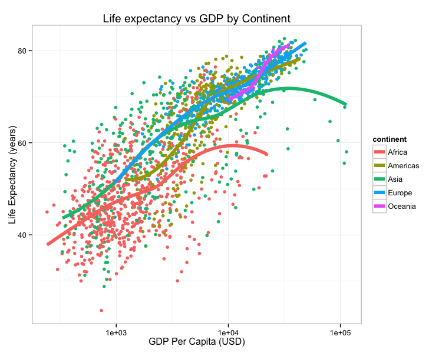
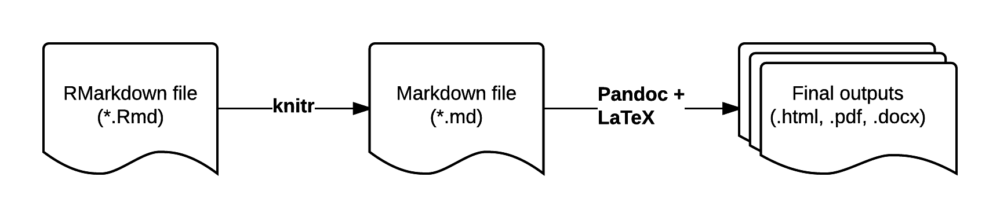

```{r init, include=F}
library(knitr)
opts_chunk$set(message=FALSE, warning=FALSE, eval=TRUE, echo=TRUE, fig.keep="none", cache=TRUE)
options(digits=3)
options(max.print=200)
.ex <- 1 # Track ex numbers w/ hidden var. Increment each ex: `r .ex``r .ex=.ex+1`

# See http://rpubs.com/turnersd/embedding-rmarkdown-chunk-into-rmarkdown
catn <- function(x="") cat("    ", x, "\n")
```

Contemporary life science is plagued by reproducibility issues. This workshop covers some of the barriers to reproducible research and how to start to address some of those problems during the data management and analysis phases of the research life cycle. In this workshop we will cover using R and dynamic document generation with RMarkdown and RStudio to weave together reporting text with executable R code to automatically generate reports in the form of PDF, Word, or HTML documents.

This lesson assumes a [basic familiarity with R](r-basics.html), [data frames](r-dataframes.html), [manipulating data with dplyr and `%>%`](r-dplyr-yeast.html), and [plotting with ggplot2](r-viz-gapminder.html). It also assumes that you've successfully installed all packages on the [R setup page](setup.html), including the [additional steps](setup.html#rmarkdown) needed specifically for this class.

## Before class

Prior to class, spend a few minutes to learn a little bit about _Markdown_. All you really need to know is that Markdown is a lightweight markup language that lets you create styled text (like **bold**, _italics_, [links](http://bioconnector.github.io/markdown), etc.) using a very lightweight plain-text syntax: `(like **bold**, _italics_, [links](http://bioconnector.github.io/markdown), etc.)`. The resulting text file can be _rendered_ into many downstream formats, like PDF (for printing) or HTML (websites).

1. _(30 seconds)_ Read the summary paragraph on the [Wikipedia page](https://en.wikipedia.org/wiki/Markdown). 
1. _(1 minute)_ Bookmark and refer to this markdown reference: <http://commonmark.org/help/>.
1. _(5-10 minutes)_ Run through this 10-minute in-browser markdown tutorial: <http://commonmark.org/help/tutorial/>.
1. _(5-10 minutes)_ Go to <http://dillinger.io/>, an in-browser Markdown editor, and play around. Write a simple markdown document, and export it to HTML and/or PDF.
1. _(10 minutes)_ See RStudio's excellent documentation on Rmarkdown at <http://rmarkdown.rstudio.com/>. Click "Getting Started" and watch the 1 minute video on the [Introduction page](http://rmarkdown.rstudio.com/lesson-1.html). Continue reading through each section here on the navigation bar to the left (_Introduction_ through _Cheatsheets_, and optionally download and print out the cheat sheet). Finally, browse through the [RMarkdown Gallery](http://rmarkdown.rstudio.com/gallery.html). 
<!-- 1. _(5-10 minutes)_ Take a look at the Markdown/Rmarkdown reference for this course: <http://bioconnector.github.io/markdown>. Scroll through the Markdown reference, which you've already seen by this point, then click the RMarkdown link at the top and skim through this.  -->
1. _(0 seconds)_ No need to look now, but don't forget that the course [help page](help.html) has some [useful resources on Markdown+RMarkdown](help.html#markdown-rmarkdown-resources).

## Who cares about reproducible research?

Science is plagued by reproducibility problems. Especially genomics!

- Scientists in the United States spend [$28 billion](http://journals.plos.org/plosbiology/article?id=10.1371/journal.pbio.1002165) each year on basic biomedical research that cannot be repeated successfully.[^spending]
- A reproducibility study in psychology found that only [39 of 100 studies could be reproduced](http://www.nature.com/news/first-results-from-psychology-s-largest-reproducibility-test-1.17433).[^psych]
- The Journal _Nature_ on the [issue of reproducibility](http://www.nature.com/news/reproducibility-1.17552):[^natureonrep]
    - "_Nature_ and the Nature research journals will introduce editorial measures to address the problem by improving the consistency and quality of reporting in life-sciences articles... **we will give more space to methods sections. We will examine statistics more closely and encourage authors to be transparent, for example by including their raw data.**"  
    - _Nature_ also released a [checklist](http://www.nature.com/authors/policies/checklist.pdf), unfortunately with _wimpy_ computational check _(see #18)_.
- On microarray reproducibility:[^microarrayrep]
    - 18 Nat. Genet. microarray experiments
    - Less than 50% reproducible
    - Problems: 
        - Missing data (38%)
        - Missing software/hardware details (50%)
        - Missing method/processing details (66%)
- NGS: run-of-the-mill variant calling (align, process, call variants):[^ngsrep]
    - 299 articles published in 2011 citing the 1000 Genomes project pilot publication
    - Only 19 were NGS studies with similar design
    - Only 10 used tools recommended by 1000G.
    - Only 4 used full 1000G workflow (realignment & quality score recalibration).

[^spending]: Freedman, et al. "The economics of reproducibility in preclinical research." _PLoS Biol_ 13.6 (2015): e1002165.
[^psych]: <http://www.nature.com/news/first-results-from-psychology-s-largest-reproducibility-test-1.17433>
[^natureonrep]: <http://www.nature.com/news/reproducibility-1.17552>
[^microarrayrep]: Ioannidis, John PA, et al. "Repeatability of published microarray gene expression analyses." _Nature genetics_ 41.2 (2009): 149-155.
[^ngsrep]: Nekrutenko, Anton, and James Taylor. "Next-generation sequencing data interpretation: enhancing reproducibility and accessibility." _Nature Reviews Genetics_ 13.9 (2012): 667-672.

Consider this figure:



How do we reproduce it? What do we need?

- The data.
    - Data points themselves.
    - Other metadata.
- The code.
    - Should be readable.
    - Comments in the code / well-documented so a normal person can figure out how it runs.
    - How were the trend lines drawn?
    - What version of software / packages were used?
    
This kind of information is rarely available in scientific publications, but it's now extraordinarly easy to put this kind of information on the web.

Could I replicate Figure 1 from your last publication? If not, what would _you and your co-authors_ need to provide or do so I could replicate Figure 1 from your last publication?

**As scientists we should aim for _robust_ and _reproducible_ research**

- "**Robust research** is about doing small things that stack the deck in your favor to prevent mistakes."  
  _---Vince Buffalo, author of Bioinformatics Data Skills (2015)_.
- **Reproducible research** can be repeated by other researchers with the same results. 

### Reproducibility is hard!

1. Genomics data is too large and high dimensional to easily inspect or visualize. Workflows involve multiple steps and it's hard to inspect every step.
1. Unlike in the wet lab, we don't always know what to expect of our genomics data analysis.
1. It can be hard to distinguish *good* from *bad* results.
1. Scientific code is usually only run once to generate results for a publication, and is more likely to contain silent bugs. (code that may produces unknowingly incorrect output rather than stopping with an error message).

### What's in it for _you?_  

Yeah, it takes a lot of effort to be robust and reproducible.  However, *it will make your life (and science) easier!*

- Most likely, you will have to re-run your analysis more than once.  
- In the future, you or a collaborator may have to re-visit part of the project.
- Your most likely collaborator is your future self, and your past self doesn't answer emails.
- You can make modularized parts of the project into re-useable tools for the future.  
- Reproducibility makes you easier to work and collaborate with.  

### Some recommendations for reproducible research

1. **Write code for humans, write data for computers.** 
    - Code should be broken down into small chunks that may be re-used.  
    - Make names/variables consistent, distinctive and meaningful.  
    - Adopt a [style](http://adv-r.had.co.nz/Style.html) be consistent.[^style]
    - Write concise and clear comments. 
1. **Make incremental changes.** Work in small steps with frequent feedback. Use version control. See <http://swcarpentry.github.io/git-novice/> for resources on version control.
1. **Make assertions and be loud, in code and in your methods.** Add tests in your code to make sure it's doing what you expect. See <http://software-carpentry.org/v4/test/> for resources on testing code.
1. **Use existing libraries (packages) whenever possible.** Don't reinvent the wheel. Use functions that have already been developed and tested by others.
1. **Prevent catastrophe and help reproducibility by making your data _read-only_.** Rather than modifying your original data directly, always use a workflow that reads in data, processes/modifies, then writes out intermediate and final files as necessary.
1. **Encapsulate the full project into one directory that is supported with version control.** See: Noble, William Stafford. "A quick guide to organizing computational biology projects." [_PLoS Comput Biol_ 5.7 (2009): e1000424](http://journals.plos.org/ploscompbiol/article?id=10.1371/journal.pcbi.1000424).
1. **Release your code and data.** Simple. Without your code and data, your research is not reproducible.
    - GitHub (<https://github.com/>) is a great place for storing, distributing, collaborating, and version-controlling code.
    - RPubs (<http://rpubs.com/>) allows you to share dynamic documents you write in RStudio online.
    - Figshare (<http://figshare.com/>) and Zenodo (<https://zenodo.org/>) allow you to upload any kind of research output, publishable or not, free and unlimited. Instantly get permanently available, citable DOI for your research output.
    - _"Data/code is available upon request"_ or _"Data/code is available at the lab's website"_ are completely unacceptable in the 21st century.
1. **Write code that uses relative paths.**
    - Don't use hard-coded absolute paths (i.e. `/Users/stephen/Data/seq-data.csv` or `C:\Stephen\Documents\Data\Project1\data.txt`). 
    - Put the data in the project directory and reference it _relative_ to where the code is, e.g., `data/gapminder.csv`, etc.  
1. **Always set your seed.** If you're doing anything that involves random/monte-carlo approaches, always use `set.seed()`.
1. **Document everything and use code as documentation.**
    - Document why you do something, not mechanics. 
    - Document your methods and workflows.
    - Document the origin of all data in your project directory.
    - Document **when** and **how** you downloaded the data.
    - Record **data** version info.
    - Record **software** version info with `session_info()`.
    - Use dynamic documentation to make your life easier.

[^style]: <http://adv-r.had.co.nz/Style.html>

## RMarkdown

RMarkdown is a variant of Markdown that lets you embed R code chunks that execute when you compile the document. What, what? Markdown? Compile? What's all this about?

### Markdown

Ever heard of HTML? It's what drives the internet. HTML is a _markup language_ - that's what the _ML_ stands for. The terminology evolved from "marking up" paper manuscripts by editors, where the editor would instruct an author or typesetter how to render the resulting text. Markup languages let you annotate **text** that you want to display with instructions about how to display it. 

I emphasize **text** because this is fundamentally different than word processing. When you use MS Word, for example, you're creating a special proprietary binary file (the .docx) file that shows you how a document looks. By contrast, writing in a markup language like HTML or Markdown, you're writing plain old text, using a text editor. The toolchain used to render the markup text into what you see on a display or in a PDF has always been and will always bee free and open. 

You can learn Markdown in about 5 minutes. Visit **[bioconnector.github.io/markdown](http://bioconnector.github.io/markdown)** for a quick-start reference and links to other resources. Let's open up a web-based Markdown editor like <http://dillinger.io/> or use a desktop Markdown editor like [MarkdownPad](http://markdownpad.com/) (Windows) or [MacDown](http://macdown.uranusjr.com/) (Mac).

### RMarkdown workflow

RMarkdown is an enhanced version of Markdown that lets you embed R code into the document. When the document is compiled/rendered, the R code is executed by R, the output is then automatically rendered as Markdown with the rest of the document. The Markdown is then further processed to final output formats like HTML, PDF, DOCX, etc.



Visit **[bioconnector.github.io/markdown](http://bioconnector.github.io/markdown/#!rmarkdown.md)** for a quick reference on RMarkdown.

## Authoring RMarkdown documents

> **_Note_**: Before going any further, open up the options (Tools, Global Options), click the RMarkdown section, and **uncheck** the box, _"Show output inline for all R Markdown documents."_

### From scratch

First, open RStudio. Create a new project. Quit RStudio, then launch RStudio using the project file (.Rproj) you just created.

Next, download the gapminder data from [the data page](data.html). Put this file in your R project directory. Maybe put it in a subdirectory called "data." Importantly, now your code and data will live in the same place.

Let's create a bare-bones RMarkdown document that compiles to HTML. In RStudio, select **File**, **New File**, **R Markdown...**. Don't worry about the title and author fields. When the new document launches, select everything then delete it. Let's author an RMarkdown file from scratch. Save it as `fromscratch.Rmd`. 

```{r, echo=F, results='asis'}
catn("# Introduction")
catn()
catn("This is my first RMarkdown document!")
catn()
catn("# Let's embed some R code")
catn()
catn("Let's load the **Gapminder** data:")
catn()
catn("```{r}")
catn("library(dplyr)")
catn("library(readr)")
catn("gm <- read_csv('data/gapminder.csv')")
catn("head(gm)")
catn("```")
catn()
catn("The mean life expectancy is `r mean(gm$lifeExp)` years.")
catn()
catn("The years surveyed in this data include: `r unique(gm$year)`.")
catn()
catn("# Session Information")
catn()
catn("```{r}")
catn("sessionInfo()")
catn("```")
```

Hit the **Knit HTML** button in the editor window. You should see the rendered document pop up.

So let's break that down to see exactly what happened there. Recall the [RMarkdown Workflow](http://bioconnector.github.io/markdown/#!rmarkdown.md#How_does_it_work?) shown above. You start with an RMarkdown document (Rmd). When you hit the Knit HTML button, The **knitr** R package parses through your source document and executes all the R code chunks defined by the R code chunk blocks. The source code itself and the results are then turned back into regular markdown, inserted into an intermediate markdown file (.md), and finally rendered into HTML by [Pandoc](http://pandoc.org/).

Try this. Instead of using the button, load the knitr package and just knit the document to markdown format. Run this in the console.

```{r, eval=FALSE}
library(knitr)
knit("fromscratch.Rmd")
```

Now, open up that regular markdown file and take a look.

<!-- indented code, what would be in markdown, starts here -->

    # Introduction
    
    This is my first RMarkdown document!
    
    # Let's embed some R code
    
    Let's load the **Gapminder** data:
    
    
    ```r
    library(dplyr)
    library(readr)
    gm <- read_csv("data/gapminder.csv")
    head(gm)
    ```
    
    ```
    ##       country continent year lifeExp      pop gdpPercap
    ## 1 Afghanistan      Asia 1952  28.801  8425333  779.4453
    ## 2 Afghanistan      Asia 1957  30.332  9240934  820.8530
    ## 3 Afghanistan      Asia 1962  31.997 10267083  853.1007
    ## 4 Afghanistan      Asia 1967  34.020 11537966  836.1971
    ## 5 Afghanistan      Asia 1972  36.088 13079460  739.9811
    ## 6 Afghanistan      Asia 1977  38.438 14880372  786.1134
    ```
    
    The mean life expectancy is 59.4744394 years.
    
    The years surveyed in this data include: 1952, 1957, 1962, 1967, 1972, 1977, 1982, 1987, 1992, 1997, 2002, 2007.

<!-- end markdown -->


### From a template with YAML metadata

Go ahead and start a new R Markdown document. Fill in some title and author information.

This is going to put a YAML header in the file that looks something like this:

```
---
title: "Gapminder Analysis"
author: "Stephen Turner"
date: "January 1, 2017"
output: html_document
---
```

The stuff between the three `---`s is metadata. You can read more about what kind of metadata can be included in the [RMarkdown documentation](http://rmarkdown.rstudio.com/). Try clicking the little wrench icon and setting some options, like including a table of contents and figure captions. Notice how the metadata front matter changes.

```
---
title: "Gapminder analysis"
author: "Stephen Turner"
date: "January 1, 2017"
output: 
  html_document: 
    fig_caption: yes
    toc: yes
---
```

Now, delete everything in that document below the metadata header and paste in what we had written before (above). Save this document under a different name (`rmdwithmeta.Rmd` for example). You'll now see that your HTML document takes the metadata and makes a nicely formatted title.

Let's add a plot in there. Open up a new R chunk with this:

```{r, echo=F, results='asis'}
catn("```{r, fig.cap='Life Exp vs GDP'}")
catn("library(ggplot2)")
catn("ggplot(gm, aes(gdpPercap, lifeExp)) + geom_point()")
catn("```")
```

Using RStudio you can fiddle around with different ways to make the graphic and keep the one you want. Maybe it looks like this:

```{r, echo=F, results='asis'}
catn("```{r, fig.cap='Life Exp vs GDP'}")
catn("library(ggplot2)")
catn("ggplot(gm, aes(gdpPercap, lifeExp)) + ")
catn("  geom_point() + ")
catn("  scale_x_log10() + ")
catn("  aes(col=continent)")
catn("```")
```

### Chunk options

You can modify the behavior of an R chunk with [options](http://yihui.name/knitr/options/). Options are passed in after a comma on the fence, as shown below. 

```{r, echo=F, results='asis'}
catn("```{r optionalChunkName, echo=TRUE, results='hide'}")
catn("# R code here")
catn("```")
```

Some commonly used options include:

- `echo`: (`TRUE` by default) whether to include R source code in the output file.
- `results` takes several possible values:
    - `markup` (the default) takes the result of the R evaluation and turns it into markdown that is rendered as usual.
    - `hide` will hide results.
    - `hold` will hold all the output pieces and push them to the end of a chunk. Useful if you're running commands that result in lots of little pieces of output in the same chunk.
    - `asis` writes the raw results from R directly into the document. Only really useful for tables.
- `include`: (`TRUE` by default) if this is set to `FALSE` the R code is still evaluated, but neither the code nor the results are returned in the output document. 
- `fig.width`, `fig.height`: used to control the size of graphics in the output.

Try modifying your first R chunk to use different values for `echo`, `results`, and `include`.

```{r, echo=F, results='asis'}
catn("```{r}")
catn("gm <- read.csv('data/gapminder.csv')")
catn("head(gm)")
catn("tail(gm)")
catn("```")
```

See the full list of options here: <http://yihui.name/knitr/options/>. There are lots!

A special note about **caching**: The `cache=` option is automatically set to `FALSE`. That is, every time you render the Rmd, all the R code is run again from scratch. If you use `cache=TRUE`, for this chunk, knitr will save the results of the evaluation into a directory that you specify. When you re-render the document, knitr will first check if there are previously cached results under the cache directory before really evaluating the chunk; if cached results exist and this code chunk has not been changed since last run (use MD5 sum to verify), the cached results will be (lazy-) loaded, otherwise new cache will be built; if a cached chunk depends on other chunks (see the `dependson` option) and any one of these chunks has changed, this chunk must be forcibly updated (old cache will be purged). **See [the documentation for caching](http://yihui.name/knitr/demo/cache/).**

### Tables

Read about printing tables at [bioconnector.github.io/markdown](http://bioconnector.github.io/markdown/#!rmarkdown.md#Printing_tables_nicely).

The [knitr](http://yihui.name/knitr/) package that runs the RMarkdown document in the background also has a function called `kable` that helps with printing tables nicely. It's only useful when you set `echo=FALSE` and `results='asis'`. Try this.


```{r, echo=F, results='asis'}
catn("```{r}")
catn("head(gm)")
catn("```")
```

Versus this:

```{r, echo=F, results='asis'}
catn("```{r, results='asis'}")
catn("library(knitr)")
catn("kable(head(gm))")
catn("```")
```

### Changing output formats

Now try this. If you were successfully able to get a LaTeX distribution installed, you can render this document as a PDF instead of HTML. Try changing the line in the metadata from `html_document` to `pdf_document`. Notice how the _Knit HTML_ button in RStudio now changes to _Knit PDF_. Try it. If you didn't get a LaTeX engine installed this won't work. Go back to the setup instructions after class to give this a try.

## Distributing Analyses: Rpubs

[RPubs.com](http://rpubs.com/) is a free service from RStudio that allows you to seamlessly publish the results of your R analyses online. Sign up for an account at [RPubs.com](http://rpubs.com/), then sign in on your browser.

Make sure your RMarkdown metadata is set to render to HTML rather than PDF. Render the document. Now notice the little **Publish** button in the HTML viewer pane. Click this. Sign in when asked, and give your document a name (usually the same name as the title of your Rmd).

Here are a few examples of documents I've published:

- <http://rpubs.com/turnersd/daily_show_guests>: Analysis of every guest who's ever been on _The Daily Show with Jon Stewart_.
- <http://rpubs.com/turnersd/twoaxes>: How to plot two different tracks of data with one axis on the left and one axis on the right.
- <http://rpubs.com/turnersd/anscombe>: Analysis of _Anscombe's Quartet_ data.

**Note how RPubs doesn't share your code!** RPubs is a great way to share your analysis but doesn't let you share the source code. This is a huge barrier to reproducibility. There are plenty of ways to do this. One way is to go to [gist.github.com](https://gist.github.com) and upload your code as a text file, then link back to the gist in your republished RPubs document. 

## Further resources

See [the (R)markdown section on this course's help page](help.html#markdown__rmarkdown_resources) for links to getting more help with reproducible research, Markdown, and RMarkdown. Need further motivation? See [this video](https://youtu.be/s3JldKoA0zw).

## Homework

Looking for more practice? [Try this homework assignment](r-rmarkdown-homework.html).

----

