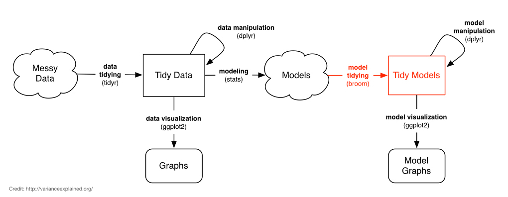

```{r setup, include=FALSE}
knitr::opts_chunk$set(echo=TRUE, eval=FALSE)
```

## Essential Statistics with R {.bigger}

Ensure you have the following packages installed:

```r
# Only need to do this once
install.packages("dplyr")
install.packages("readr")
install.packages("ggplot2")
```

Load the packages. Ask for help if any of these fail with an error.


```r
# Do this in each new session
library(dplyr)
library(readr)
library(ggplot2)
```

## Essential Statistics with R: Agenda 

1. NHANES data -- overview, import
1. Descriptive statistics & Exploratory data analysis (EDA)
1. Continuous variable statistics
    - T-tests
    - Wilcoxon / Mann-Whitney U tests
    - ANOVA
    - Linear models & multiple regression
1. Discrete variable statistics
    - Contingency tables
    - Chi-square & Fisher exact tests
    - Logistic regression
1. _If time allows_: Power & sample size analysis
1. _Bonus_: Model tidying and extraction

## What this class is _not_ {.bigger}

- This is _not_ an introductory R class. Pre-requisites: 
    - Installing/using packages
    - Importing data, saving results
    - Familiarity with readr, dplyr `%>%`, and ggplot2 recommended
- This is _not_ a statistics course. Not covering:
    - Underlying mathematical motivation
    - How to choose the correct statistical procedure
    - Model assumptions
    - Interpreting every aspect of model output

## Course website: **[bioconnector.org](http://bioconnector.org)** {.bigger}

- Data
- Setup instructions
- Lessons dropdown: all course material & link to HW/exercises
- **`?`** dropdown: FAQs, resources, etc.

## Getting started

Go to **[bioconnector.org](http://bioconnector.org)**. Hit the **data** link. Download **`nhanes.csv`** and **`nhanes_dd.csv`**. Save them both somewhere on your computer you can easily find. E.g., create a new folder on your desktop called **`rstats`** and save it there.

Open RStudio. **File** -- **New file** -- **R script**. Save this file as **`nhanes_analysis.R`** in the same **`rstats`** folder above.

Quit RStudio, then double-click the R script to open R running in the `rstats` folder. You can also do this through the menu with **Session** -- **Set working directory** -- **To Source File Location**.

Load the required libraries and data:

```r
library(dplyr)
library(readr)
nh <- read_csv("nhanes.csv")
```

(If you don't have these packages installed, use `install.packages("dplyr")` and `install.packages("dplyr")`).

## T-tests vs ANOVA vs linear models

- T-test: difference in means between two groups
- ANOVA: difference in means between 2+ groups
- Linear model: How does a continuous outcome change with one or more predictor variables?

**T-tests are specific cases of ANOVA, which is a specific case of linear regression.**

**Linear regression**: "Do levels of a categorical variable affect the response?"

**ANOVA/t-tests**: "Does the mean response differ between levels of a categorical variable?"

## Linear regression

Simple linear regression, single predictor variable _X_:

$$Y = \beta_{0} +  \beta_{1}X$$

Multiple regression: 

$$Y = \beta_{0} +  \beta_{1}X_{1} + \beta_{2}X_{2} + \epsilon$$

- $Y$ is the response 
- $X_{1}$ and $X_{2}$ are the predictors
- $\beta_{0}$ is the intercept, and $\beta_{1}$, $\beta_{2}$ etc are _coefficients_ that describe what 1-unit changes in $X_{1}$ and $X_{2}$ do to the outcome variable $Y$.
- $\epsilon$ is random error. Our model will not perfectly predict $Y$. It will be off by some random amount. We assume this amount is a random draw from a Normal distribution with mean 0 and standard deviation $\sigma$.

## Logistic regression: model

> What if we wanted to model the discrete outcome, e.g., whether someone is insured, against several other variables, similar to how we did with multiple linear regression? We can't use linear regression because the outcome isn't continuous -- it's binary, either **Yes** or **No**. For this we'll use **logistic regression** to model the **log odds** of binary response. That is, instead of modeling the outcome variable, $Y$, directly against the inputs, we'll model the **log odds** of the outcome variable.

If $p$ is the probability that the individual is insured, then $\frac{p}{1-p}$ is the [_odds_](https://en.wikipedia.org/wiki/Odds) that person is insured. The _generalized linear model_ is expressed as:

$$log(\frac{p}{1-p}) = \beta_0 + \beta_1 x_1 + \cdots + \beta_k x_k$$

Where $\beta_0$ is the intercept, $\beta_1$ is the increase in the log odds of the outcome for every unit increase in $x_1$. Rearranging the formula a little bit will show that **$e^{\beta_1}$ is the odds ratio for $x_1$**.

## Logistic regression: implementation

Logistic regression is a type of _generalized linear model_ (GLM). We fit GLM models in R using the `glm()` function. It works like the `lm()` function except we specify which GLM to fit using the `family` argument. Logistic regression requires `family=binomial`.

```r
mod <- glm(y ~ x, data=yourdata, family='binomial')
summary(mod)
```

## Power & sample size

**Power** (a.k.a. "sensitivity"): probability that your test correctly rejects the null hypothesis when the alternative hypothesis is true. That is, if there really is an effect (difference in means, association between categorical variables, etc.), how likely are you to be able to _detect_ that effect at a given statistical significance level, given certain assumptions. **Know two, estimate the third**:

1. **Power**: How likely are you to detect the effect? (Usually want 80%).
1. **N**: What is the sample size you have (or require)?
1. **Effect size**: How big is the difference in means, odds ratio, etc?

(Other assumptions include desired $\alpha$ and $\sigma$).

```r
# Power for a t-test
power.t.test(power, n, delta, sig.level=0.05, sd=1)
# Power for a two-sample test of proportions
power.prop.test(power, n, p1, p2, sig.level=0.05)
```

## Model tidying {.smaller}

We put a lot of emphasis on _tidy **data**_, where each column is a variable and each row is an observation. But even when we start with tidy _data_, we don't end up with tidy _models_. The output from tests like `t.test` or `lm` are not data.frames, and it's hard to get the information out of the model object that we want. The [**broom** package](https://github.com/dgrtwo/broom) bridges this gap.



1. **`tidy`**: constructs a data frame that summarizes the model's statistical findings like coefficients and p-values.
2. **`augment`**: add columns to the original data that was modeled, like predictions and residuals.
3. **`glance`**: construct a concise _one-row_ summary of the model with information like $R^2$ that are computed once for the entire model.
