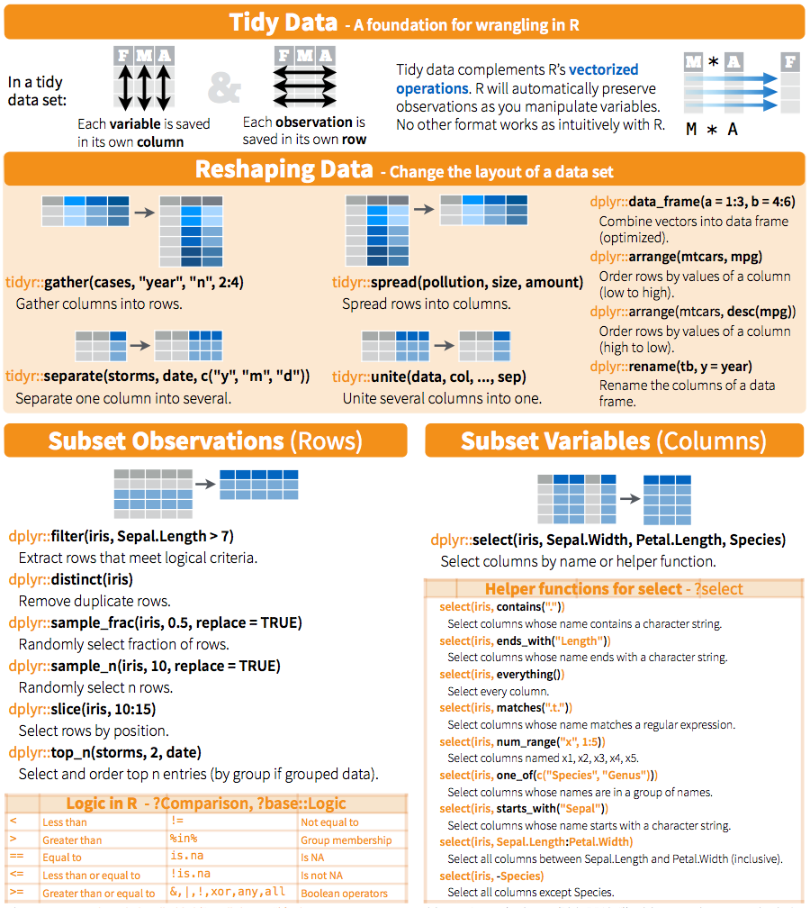
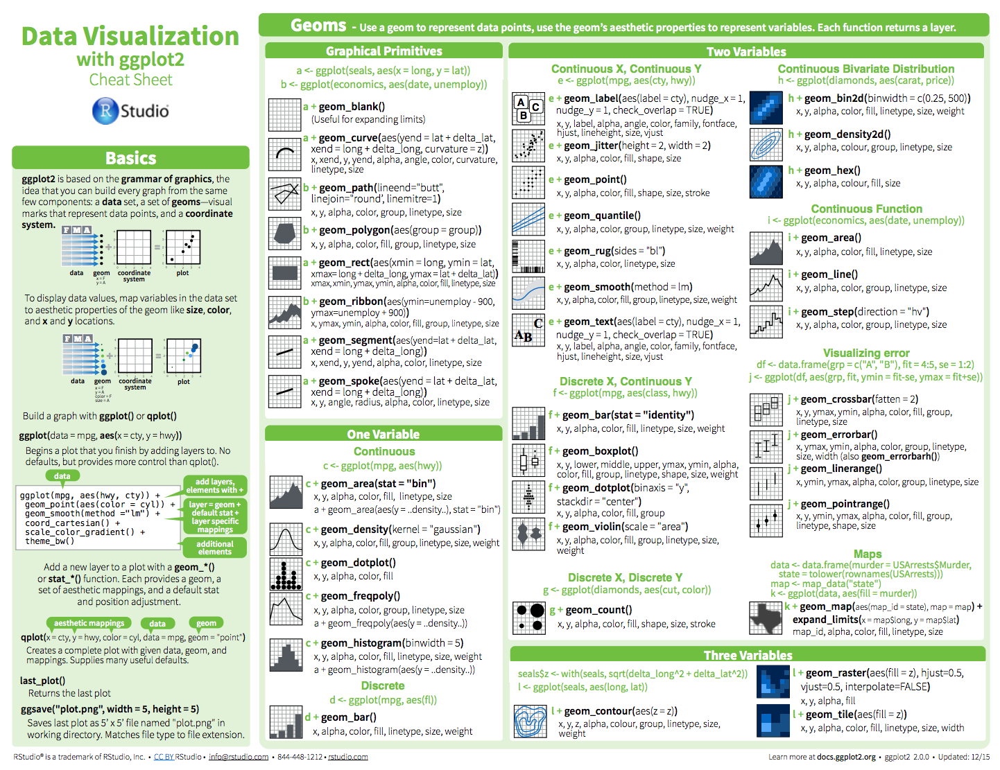

```{r setup, include=FALSE}
knitr::opts_chunk$set(echo = FALSE)
```

## Logistics

### Meetings

- Tuesdays, Oct 17 - Dec 19
- 2-5pm in this room (except Nov 14, HSL Carter Classroom)

### Instructor

Stephen Turner (Bioinformatics Core Director, PHS)  
<turner@virginia.edu>

### Course Website

**[bioconnector.org/workshops/thriv](http://bioconnector.org/workshops/thriv)**

_-or, shorter:-_

**[git.io/thriv](http://git.io/thriv)**

## Agenda

Subject to change!

1. Week 1: Intro to R
1. Week 2: Advanced Data Manipulation & Tidy Data
1. Week 3: Advanced Data Visualization with ggplot2
1. Week 4: Reproducible Research & Dynamic Documents
1. Week 5: Essential Statistics
1. Week 6-7: Pick two:
    - Survival Analysis
    - Introduction to RNA-seq Data Analysis
    - Phylogenetic trees


## Week 1 (today!): Intro to R

Novice-level introduction to the R, RStudio, and basic functionality such as creating variables, getting help, using data frames, basic plotting, and reading/writing files.

**Why R?**

- Free
- Huge community support
- 10,000+ free add-on packages
- [Bioconductor](http://bioconductor.org): huge resource for bioinformatics-specific functionality, packages, data, ...
- [Amazing graphics](https://www.google.com/search?q=ggplot2&tbm=isch)
- Reproducible research (Week 4)
- Tons of resources ([StackOverflow](http://stackoverflow.com/questions/tagged/r), [Coursera](https://www.coursera.org/specializations/jhu-data-science), ...)

## Week 2: Advanced Data Manipulation & Tidy Data

**[Janitor work](https://www.nytimes.com/2014/08/18/technology/for-big-data-scientists-hurdle-to-insights-is-janitor-work.html):** Filtering, reshaping, subsetting, split-apply-combine, joining, etc.



## Week 3: Advanced Data Visualization with ggplot2



## Week 4: Reproducible Research & Dynamic Documents {.bigger}

- What's reproducible research all about?
- How to do it with **[RMarkdown](http://rmarkdown.rstudio.com/)**.

## Week 5: Essential Statistics

1. Descriptive statistics & Exploratory data analysis (EDA)
1. Continuous variable statistics
    - T-tests
    - Wilcoxon / Mann-Whitney U tests
    - ANOVA
    - Linear models & multiple regression
1. Discrete variable statistics
    - Contingency tables
    - Chi-square & Fisher exact tests
    - Logistic regression
1. _If time allows_: Power & sample size analysis
1. _Bonus_: Model tidying and extraction


## Week 6-7 {.smaller}

### Survival Analysis

1. Survival analysis overview, definitions
1. Survival analysis in R using built-in data
    - Survival curves + life tables
    - Kaplan-Meier curves
    - Cox proportional hazards regression
1. Example with TCGA data

### Introduction to RNA-seq Data Analysis

1. Our data: source, pre-processing, structure
1. Importing & exploring
1. Processing and analysis with [DESeq2](http://bioconductor.org/packages/DESeq2)
    - Structuring the count data and metadata
    - Running the analysis (normalization, dispersion estimation, model fitting)
    - Extracting results
1. Data visualization
1. Alternative approaches
1. Pathway analysis

### Phylogenetic Trees

1. Importing phylogenetic tree data
1. Drawing and annotating phylogenetic trees

## Rubric

- Assignments will be given out at the end of each period.
- Upload programming assignments to Collab.
- We'll review parts of the homework at the beginning of the next period.

## Let's get started!

1. Launch RStudio (_not_ R).
1. Let me know if you have trouble.
